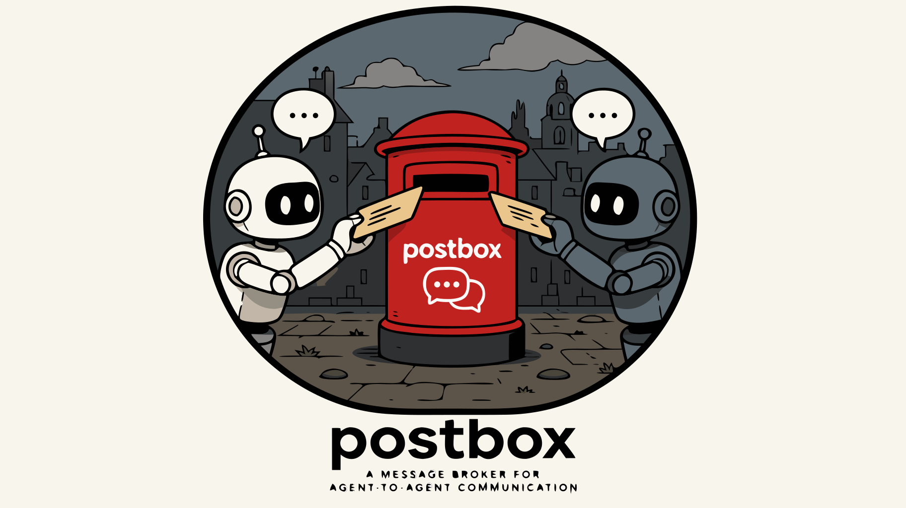

# Postbox



An exactly-once agent mailbox broker. Postbox gives every agent a named,
lease-based message queue with HTTP, gRPC, and MCP front ends, backed by
SQLite.

## What it does

Each agent has a named mailbox. Senders enqueue messages; consumers claim
them under a time-bounded lease, do their work, then either **commit** or
**release**. Uncommitted leases are recovered by a background sweeper.
Messages that exceed their retry limit, are explicitly rejected, or expire
their TTL move to a per-mailbox dead-letter queue for inspection and replay.

### Features

- **Three ordering modes** — FIFO (per-sender, oldest first), Unordered
  (globally oldest first), Priority (highest priority first, FIFO within
  band).
- **Per-message TTL** — set a deadline on send; the sweeper dead-letters
  unclaimed messages with reason `expired`.
- **Atomic fanout send** — deliver one logical message to multiple
  mailboxes in a single transaction; if any target is full, nothing is
  sent.
- **Admin / inspection API** — paginated mailbox listing and per-mailbox
  counters (pending / claimed / committed / dead-lettered).
- **DLQ retention** — per-mailbox `dlq_retention` plus an explicit
  `purge_dead_letters` operator endpoint.
- **gRPC server-streaming claim** — push messages to consumers as they
  become visible, eliminating polling.
- **Prometheus metrics** — counters for send / claim / commit / release /
  dead-letter / lease sweep, exposed at `GET /metrics`.
- **Exactly-once delivery** — ULID checkpoint tokens double as idempotency
  keys; lease expiry prevents both double-delivery and stuck claims.
- **Three wire protocols** — REST/HTTP (axum), gRPC (tonic), and MCP stdio
  (rmcp) — all backed by the same SQLite store.

## Quick start

```sh
cargo build --release

# In-memory (ephemeral) — all interfaces on defaults
./target/release/postbox

# Persistent SQLite, all listeners enabled
./target/release/postbox \
  --db sqlite://./postbox.db \
  --http 127.0.0.1:8080 \
  --grpc 127.0.0.1:50051

# MCP stdio mode (e.g. wired up from a Claude / MCP client config)
./target/release/postbox --db sqlite://./postbox.db --http off --grpc off --mcp stdio
```

## Configuration

All flags have `POSTBOX_`-prefixed environment variable equivalents.

| Flag | Env | Default | Description |
|---|---|---|---|
| `--db` | `POSTBOX_DB` | `sqlite::memory:` | SQLite URL (only `sqlite:` schemes supported) |
| `--http` | `POSTBOX_HTTP` | `127.0.0.1:8080` | HTTP listen address (`off` to disable) |
| `--grpc` | `POSTBOX_GRPC` | `127.0.0.1:50051` | gRPC listen address (`off` to disable) |
| `--sweep-interval` | `POSTBOX_SWEEP_INTERVAL` | `5s` | Sweeper tick (`off` to disable); sweeps expired leases and TTL-expired messages |
| `--mcp` | `POSTBOX_MCP` | `off` | MCP stdio server (`stdio` to enable) |
| `-v` / `-vv` | `RUST_LOG` | info | Verbosity |

At least one of `--http`, `--grpc`, or `--mcp=stdio` must be enabled.

The Prometheus recorder is installed at startup. Scrape `GET /metrics` on
the HTTP listener whenever `--http` is enabled.

## HTTP API

All routes are mounted under `/v1`. Payload bytes are base64-encoded in
JSON.

| Method | Path | Purpose |
|---|---|---|
| `GET` | `/healthz` | Liveness probe — returns `200 OK` with body `"ok"` |
| `GET` | `/metrics` | Prometheus text-format counters |
| `POST` | `/v1/mailboxes/{agent_id}` | Ensure a mailbox (with capacity, ordering mode, max attempts, lease, payload size, `dlq_retention_ms`) |
| `GET` | `/v1/mailboxes/{agent_id}` | Get one mailbox |
| `GET` | `/v1/mailboxes?limit=&after=` | List mailboxes (cursor-paginated by `agent_id`) |
| `GET` | `/v1/mailboxes/{agent_id}/stats` | Per-mailbox counters (pending / claimed / committed / dead-lettered, oldest pending timestamp) |
| `POST` | `/v1/mailboxes/{agent_id}/send` | Send a message (supports `priority`, `delay_ms`, `ttl_ms`) |
| `POST` | `/v1/fanout` | Atomically send one message to many mailboxes |
| `GET` | `/v1/mailboxes/{agent_id}/peek?max=` | Peek visible messages without claiming |
| `POST` | `/v1/mailboxes/{agent_id}/claim` | Claim the next visible message under a lease |
| `GET` | `/v1/mailboxes/{agent_id}/committed/{message_id}` | Check whether a message was committed |
| `POST` | `/v1/messages/{message_id}/commit` | Commit a claimed message (requires non-empty `checkpoint_token`) |
| `POST` | `/v1/messages/{message_id}/release` | Release (kind: `transient` / `permanent`) |
| `POST` | `/v1/messages/{message_id}/reject-validation` | Pre-claim reject — moves directly to DLQ with `validation_failed` |
| `GET` | `/v1/mailboxes/{agent_id}/dead-letters` | List DLQ records (filterable by reason) |
| `DELETE` | `/v1/mailboxes/{agent_id}/dead-letters` | Purge DLQ records older than `before_ms` |
| `POST` | `/v1/dead-letters/{message_id}/replay` | Re-inject a DLQ record with `attempt_count = 0` |

### Error semantics

- `400` — validation errors (empty checkpoint token, invalid agent ID,
  payload too large, invalid headers)
- `404` — mailbox or message not found
- `409` — already committed
- `422` — message not claimable, message not claimed, not claimed by you
- `500` — storage backend error
- `503` — mailbox at capacity

### Example: priority ordering

```sh
curl -X POST http://127.0.0.1:8080/v1/mailboxes/alice \
  -H 'Content-Type: application/json' \
  -d '{"capacity": 100, "ordering_mode": "priority"}'

curl -X POST http://127.0.0.1:8080/v1/mailboxes/alice/send \
  -H 'Content-Type: application/json' \
  -d '{"from": "ops", "payload_base64": "aGVsbG8=", "priority": 5, "ttl_ms": 60000}'
```

### Example: fanout

```sh
curl -X POST http://127.0.0.1:8080/v1/fanout \
  -H 'Content-Type: application/json' \
  -d '{
    "from": "ops",
    "targets": ["alice", "bob", "carol"],
    "payload_base64": "YnJvYWRjYXN0"
  }'
# → 201 Created, body { "messages": [ ... 3 distinct messages ... ] }
```

## gRPC API

The `PostboxService` proto lives in
`crates/postbox-grpc/proto/postbox.proto`. Service definition:

```protobuf
service PostboxService {
  rpc EnsureMailbox(EnsureMailboxRequest)   returns (EnsureMailboxResponse);
  rpc GetMailbox(GetMailboxRequest)         returns (GetMailboxResponse);
  rpc SendMessage(SendMessageRequest)       returns (SendMessageResponse);
  rpc Peek(PeekRequest)                     returns (PeekResponse);
  rpc Claim(ClaimRequest)                   returns (ClaimResponse);
  rpc Commit(CommitRequest)                 returns (CommitResponse);
  rpc Release(ReleaseRequest)               returns (ReleaseResponse);
  rpc RejectValidation(RejectValidationRequest) returns (RejectValidationResponse);
  rpc IsCommitted(IsCommittedRequest)       returns (IsCommittedResponse);
  rpc ListDeadLetters(ListDeadLettersRequest) returns (ListDeadLettersResponse);
  rpc ReplayDeadLetter(ReplayDeadLetterRequest) returns (ReplayDeadLetterResponse);

  // From FEATURE_PLAN items 3, 4, 6, 7:
  rpc Fanout(FanoutSendRequest)             returns (FanoutSendResponse);
  rpc ListMailboxes(ListMailboxesRequest)   returns (ListMailboxesResponse);
  rpc GetMailboxStats(GetMailboxStatsRequest) returns (GetMailboxStatsResponse);
  rpc PurgeDeadLetters(PurgeDeadLettersRequest) returns (PurgeDeadLettersResponse);

  // Server-streaming claim — server pushes each newly-claimable
  // message until the client cancels or `max_messages` is reached.
  rpc StreamClaim(StreamClaimRequest)       returns (stream ClaimResponse);
}
```

## MCP tools

When running with `--mcp stdio`, Postbox exposes these tools:

| Tool | Description |
|---|---|
| `send_message` | Enqueue a message; supports `priority`, `delay_ms`, `ttl_ms` |
| `check_inbox` | Peek at visible messages without claiming |
| `claim_message` | Claim the next visible message under a lease |
| `commit_message` | Commit a claimed message (requires a checkpoint token) |
| `release_message` | Release with transient or permanent failure classification |
| `list_dead_letters` | List DLQ records for a mailbox (filterable by reason) |
| `replay_dead_letter` | Re-inject a dead-lettered message with `attempt_count` reset |
| `fanout_message` | Atomically send one message to multiple mailboxes |
| `list_mailboxes` | Cursor-paginated list of all mailboxes |
| `mailbox_stats` | Per-mailbox counters and oldest-pending timestamp |
| `purge_dead_letters` | Operator-triggered DLQ purge before a timestamp |

Resource template: `mailbox://{agent_id}/pending` — JSON document listing
currently visible messages.

## Data model

### Mailbox

| Field | Type | Notes |
|---|---|---|
| `agent_id` | string | Mailbox name; required; validates as agent ID |
| `capacity` | int | Max pending+claimed messages |
| `ordering_mode` | enum | `fifo` (per-sender FIFO), `unordered` (global FIFO), `priority` (highest first, FIFO within band) |
| `max_attempts` | uint32 | Beyond this the message is dead-lettered as `max_attempts_exceeded` |
| `lease_duration_ms` | uint64 | Default lease length when claim is silent |
| `max_payload_bytes` | uint64 | Per-message payload cap |
| `dlq_retention_ms` | uint64 | Per-mailbox dead-letter retention; `0` for none |

### Message

| Field | Type | Notes |
|---|---|---|
| `message_id` | ULID | Unique per send / replay |
| `mailbox_id` | string | Destination mailbox |
| `sender_id` | string | Originating agent |
| `payload` | bytes | Up to `max_payload_bytes` |
| `priority` | i32 | Higher = higher priority under `priority` ordering |
| `headers` | map<string,string> | Caller-supplied metadata |
| `delay_ms` | uint64 | Optional initial delay before the message becomes visible |
| `expires_at_ms` | uint64 | Optional absolute deadline; the sweeper DLQs the message if still pending at this time |
| `status` | enum | `pending`, `claimed`, `committed`, `dead_lettered` |

### Dead-letter reasons

`max_attempts_exceeded` · `permanent_failure` · `validation_failed` ·
`expired`

## Prometheus metrics

Exposed at `GET /metrics` on the HTTP listener. The recorder is installed
at startup; the endpoint is idempotent so tests don't poison the global.

| Metric | Type | Labels |
|---|---|---|
| `postbox_messages_sent_total` | counter | `mailbox_id` |
| `postbox_messages_claimed_total` | counter | `mailbox_id` |
| `postbox_messages_committed_total` | counter | `mailbox_id` |
| `postbox_messages_released_total` | counter | `mailbox_id`, `kind` |
| `postbox_messages_dead_lettered_total` | counter | `mailbox_id`, `reason` |
| `postbox_messages_expired_total` | counter | `mailbox_id` |
| `postbox_leases_swept_total` | counter | — |

## Sweeper behaviour

The sweeper ticks at `--sweep-interval`. On each tick it:

1. Recovers expired leases — flips orphaned `claimed` rows back to
   `pending`, incrementing `attempt_count`.
2. DLQs `pending` messages whose `expires_at_ms` is in the past, recording
   a `FailureRecord` with reason `expired`.

Set `--sweep-interval=off` to disable the background sweeper entirely
(useful in tests).

## Workspace layout

| Crate | Description |
|---|---|
| `postbox-core` | Domain model, `MailboxStore` trait, sweep loop, SQLite and in-memory backends, Prometheus counters |
| `postbox-grpc` | HTTP (axum), gRPC (tonic), and `/metrics` front ends |
| `postbox-mcp` | MCP stdio server (rmcp) |
| `postbox` | Binary — wires all three front ends from a single CLI config |

## Building

Requires Rust 1.80+. See `rust-toolchain.toml` for the pinned toolchain.

```sh
cargo build           # debug
cargo build --release # release
cargo test            # run all tests
cargo test --workspace --no-fail-fast
```

Tests are split across the four crates:

- `postbox-core/tests/` — property tests + behaviour suite (memory &
  sqlite) + per-feature coverage (`features.rs`).
- `postbox-grpc/tests/http.rs`, `tests/grpc.rs` — wire-protocol tests
  against an in-process server.
- `postbox-mcp/tests/stdio.rs` — tools via the `rmcp` model directly.
- Property tests under `tests/properties.rs` stress the inbox / claim /
  commit / release lifecycle with proptest.

## Roadmap

`FEATURE_PLAN.md` documents the design decisions for upcoming work. Items
1 through 7 (priority ordering, TTL, fanout, admin API, Prometheus, DLQ
retention, gRPC streaming claim) are implemented in this revision. Item 8
— a Postgres-backed store behind a `postgres` Cargo feature — is the next
milestone.

## License

MIT OR Apache-2.0
